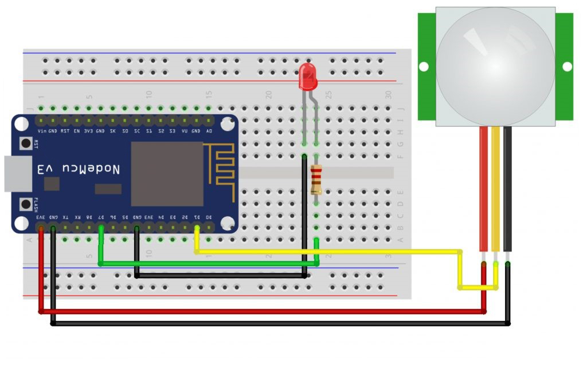
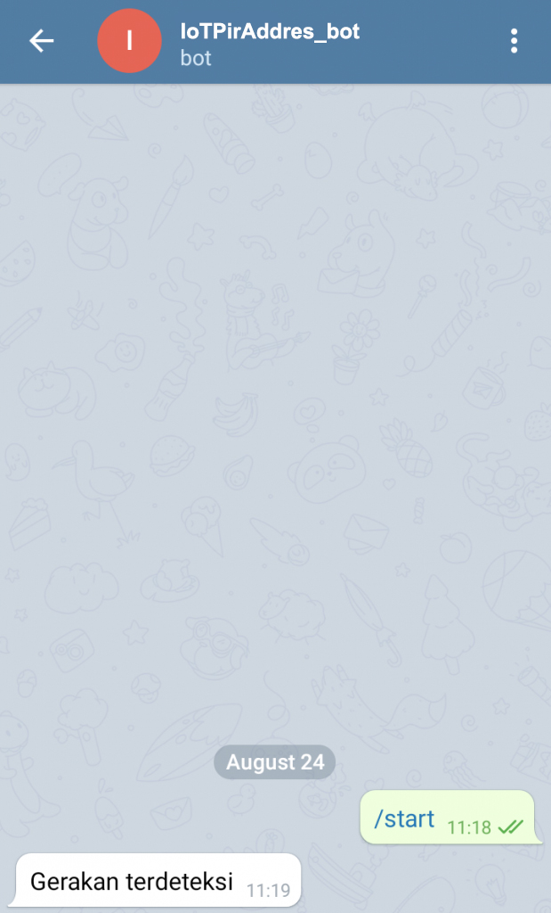

# Telegram IoT PiR Address

## Description

- PIR (Passive Infrared), is a sensor that measures infrared radiation from an object. PIR works passively, therefore PIR only receives radiation and does not emit radiation. If this sensor is connected to an IoT device, the measurement data can be accessed from anywhere.

## Circuit Schematic

- Below you can see a schematic image to facilitate the wiring of cables from the microcontroller to devices, both input and output sensors:

 <br/>

## Component (Tools and Materials):

- NodeMCU ESP8266: 1 piece;
- Breadboard: 1 piece;
- PIR sensor: 1 piece;
- LED: 1 piece;
- 220Ω resistor: 1 piece;

## Code

```cpp
#include "CTBot.h"  //Pendeklarasian Library
CTBot myBot;

String ssid = "Veendy-Suseno";    //nama ssid wifi kalian
String pass = "Admin12345";  //password wifi kalian
String token = "XXXX";    //token bot baru kalian
const int id = XXXX;      //id telegram kalian

#define ledPin D7  // Pemilihan Pin dan pendeklarasian variabel
#define pirPin D1
int pirValue;

void setup(){  //Pengaturan Pin dan Variabel
    Serial.begin(9600);
    Serial.println("Starting TelegramBot...");
    myBot.wifiConnect(ssid, pass);
    myBot.setTelegramToken(token);
    if (myBot.testConnection()) {
        Serial.println("Koneksi Bagus");
    } else {
        Serial.println("Koneksi Jelek");
    }
    pinMode(ledPin, OUTPUT);
    pinMode(pirPin, INPUT);
    digitalWrite(ledPin, LOW);
}

void loop(){ //Perulangan Program
    pirValue = digitalRead(pirPin);
    digitalWrite(ledPin, pirValue);
    if (pirValue == HIGH)  //Apabila Terdeteksi Gerakan
    {
        Serial.println("Gerakan terdeteksi");
        myBot.sendMessage(id, "Gerakan terdeteksi");
    }
    delay(100);
}

```

## Interface:

 <br/>

## Usage

1. Setup Your Environment:

   - Ensure you have the Arduino IDE installed.
   - Install the required libraries: CTBot, ESP8266WiFi, and any other dependencies.

2. Configure the Code:

   - Replace ssid and pass with your WiFi credentials.
   - Replace token with your Telegram bot token.
   - Replace id with your Telegram chat ID.

3. Upload the Code:

   - Connect your NodeMCU ESP8266 to your computer.
   - Open the Arduino IDE and select the correct board and port.
   - Upload the code to your NodeMCU.

4. Connect the Components:

   - Wire the PIR sensor to the D1 pin and the LED to the D7 pin on the NodeMCU.
   - Connect the 220Ω resistor in series with the LED to prevent excessive current.

5. Monitor and Control:
   - Open the Serial Monitor in the Arduino IDE to view connection status and motion detection messages.
   - When motion is detected by the PIR sensor, the LED will light up and a message will be sent to your Telegram account.

## How to Use

1. Setup Telegram Bot:

   - Create a new bot using BotFather on Telegram and obtain your bot token.
   - Find your Telegram chat ID by sending a message to your bot and using the Telegram API to get updates.

2. Deploy and Test:
   - Ensure your NodeMCU is connected to WiFi and has access to the internet.
   - Test the setup by moving in front of the PIR sensor and check if the LED lights up and you receive a message on Telegram.

## Conclusion:

- In this project, if someone enters a room that has a PIR sensor, the PIR sensor will provide an output which will be read by the NodeMCU which will then make the LED light up and will convey a message to our Telegram that there is movement detected
